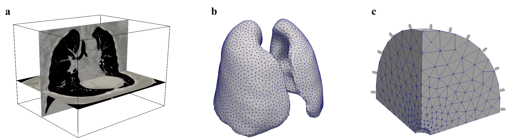
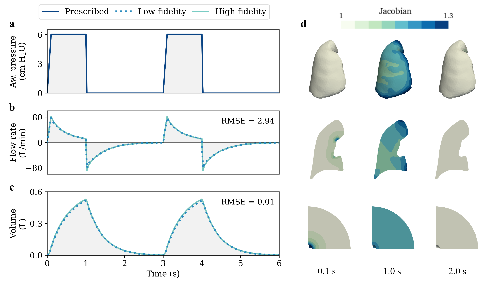
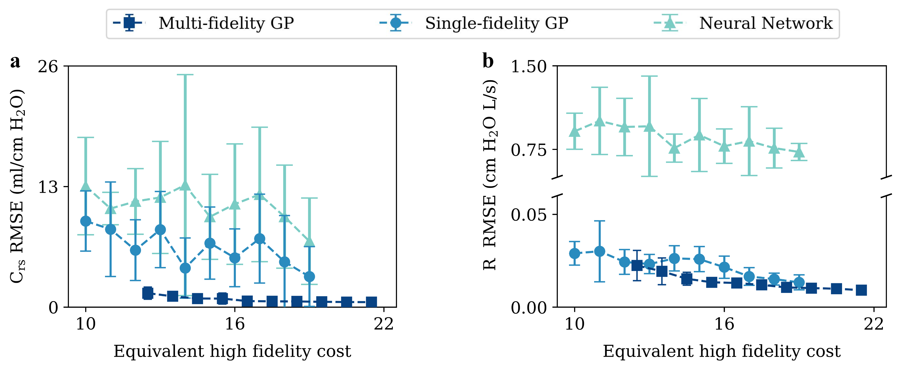
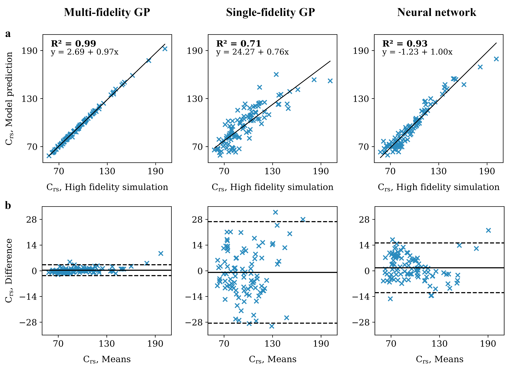
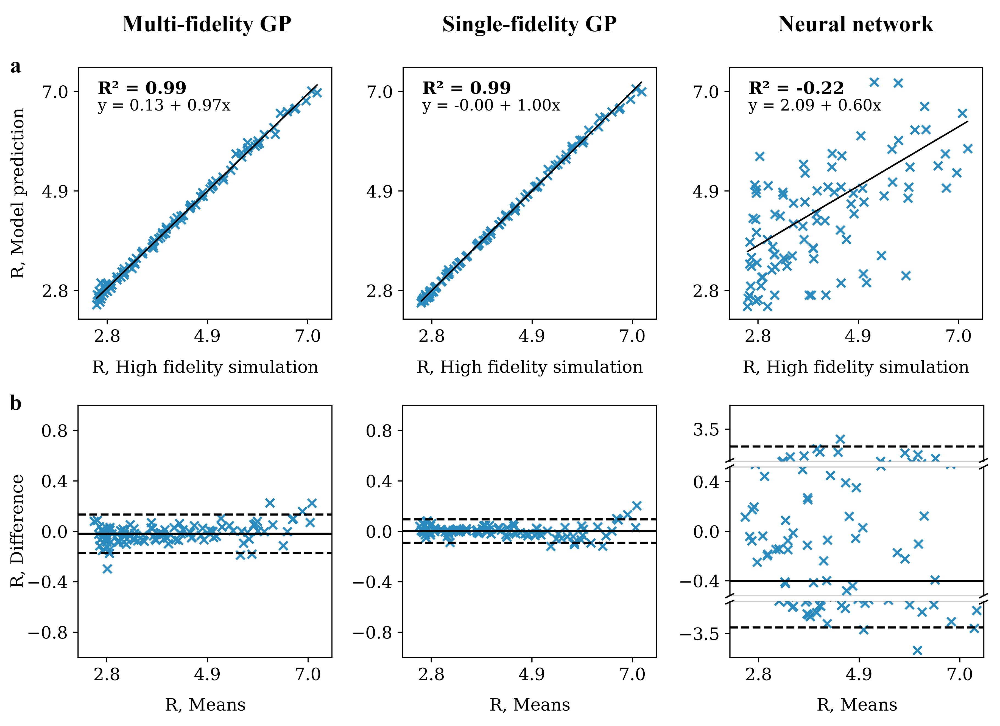
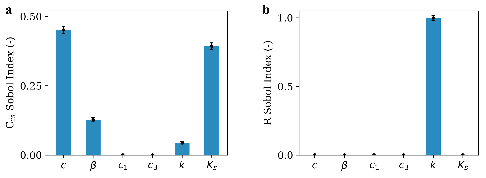
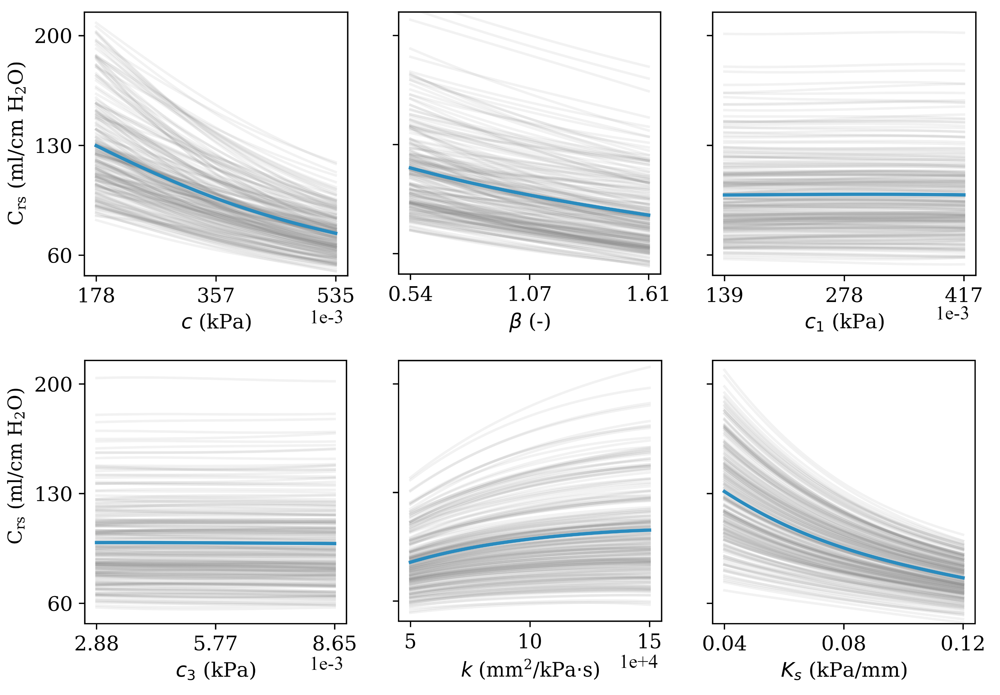
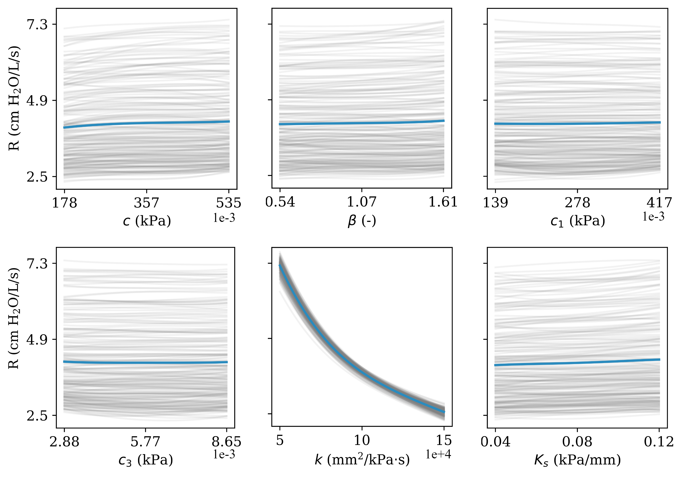
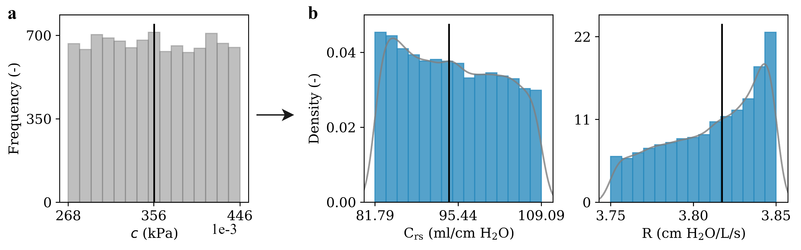
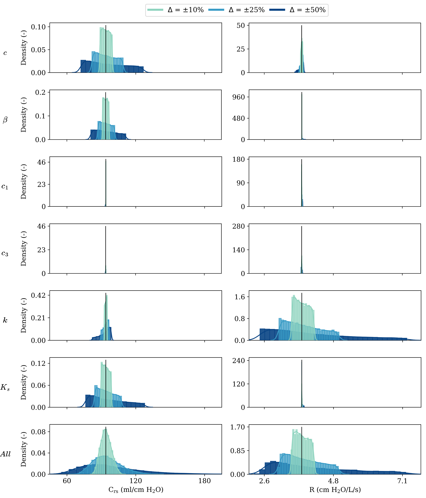

# Machine learning modeling of lung mechanics: assessing the variability and propagation of uncertainty in respiratory-system compliance and airway resistance

Leverage of machine learning techniques to construct predictive lung function models informed by finite element simulations.

## Abstract
Background and Objective: Traditional assessment of patient response in mechanical ventilation relies on respiratory-system compliance and airway resistance. Clinical evidence has shown high variability in these parameters, highlighting the difficulty of predicting them before the start of ventilation therapy. This motivates the creation of computational models that can connect structural and tissue features with lung mechanics. In this work, we leverage machine learning (ML) techniques to construct predictive lung function models informed by non-linear finite element simulations, and use them to investigate the propagation of uncertainty in the lung mechanical response.
        
Methods: We revisit a continuum poromechanical formulation of the lungs suitable for determining patient response. Based on this framework, we create high-fidelity finite element models of human lungs from medical images. We also develop a low-fidelity model based on an idealized sphere geometry. We then use these models to train and validate three ML architectures: single-fidelity and multi-fidelity Gaussian process regression, and artificial neural networks. We use the best predictive ML model to further study the sensitivity of lung response to variations in tissue structural parameters and boundary conditions via sensitivity analysis and forward uncertainty quantification. 
        
Results: The low-fidelity model delivers a lung response very close to that predicted by high-fidelity simulations and at a fraction of the computational time. Regarding the trained ML models, the multi-fidelity GP model consistently delivers better accuracy than the single-fidelity GP and neural network models in estimating respiratory-system compliance and resistance ($R^2\sim 0.99$). In terms of computational efficiency, our ML model delivers a massive speed-up of $\sim970,000\times$ with respect to high-fidelity simulations. Regarding lung function, we observed an almost matched and non-linear behavior between specific structural parameters and chest wall stiffness with compliance. Also, we observed a strong modulation of airways resistance with tissue permeability.
        
Conclusions: Our findings unveil the relevance of specific lung tissue parameters and boundary conditions in the respiratory-system response. Furthermore, we highlight the advantages of adopting a multi-fidelity ML approach that combines data from different levels to yield accurate and efficient estimates of clinical mechanical markers. We envision that the methods presented here can open the way to the development of predictive ML models of the lung response that can inform clinical decisions.

## Directories
- `results-data`: Figures and related results from processed from `raw-data` and `tests`.
- `raw-data`: Input data needed for simulations + data generated from `tests`.
- `src`: Files that implement functions used in simulations.
- `tests`:  Code files that implement the described work.

## Results
The main results of this research are shown below. Figure 3 shows the airway pressure, flow and volume signals predicted by high and low fidelity models of the lung during PCV simulations.

Figure 1. Construction of high-fidelity and low-fidelity lung finite-element models. (a) Computed-tomography image from which the lung domain is determined, (b) high-fidelity finite-element mesh generated from image lung domain, and (c) finite-element mesh generated for the low-fidelity lung model.

Figure 2. Simulation of lungs under PCV ventilation model. Physiological signals that describe the time evolution of (a) airways pressure, (b) flow, and (c) volume (c) are shown for the high-fidelity (solid lines) and low-fidelity model (dashed lines).

Figure 3. Effect of the equivalent high-fidelity cost (training sample size) on the prediction performance of the multi-fidelity GP, single-fidelity GP, and neural network models. (a) Respiratory-system compliance, and (b) Resistance. Results shown are for the testing set predictions. Dashed lines and error bars denote the average and standard deviation of the RMSE, respectively.

Figure 4. Performance comparison of multi-fidelity GP, single-fidelity GP, and neural network models on the respiratory-system compliance. All units are in ml/cm H$_{\text{2}}$O. Regarding the high-fidelity data for training, each model was trained with a training size of 95\% (19 observations). The predictions on the testing set are analyzed using (a) correlation plots, and (b) Bland-Altman plots. In Bland-Altman plots, solid lines represent the mean difference between the high-fidelity simulations and model predictions, while dashed lines represent their corresponding $\pm$1.96 standard deviations.

Figure 5. Performance comparison of multi-fidelity GP, single-fidelity GP and neural network models on the airways resistance. All units are in cm H$_{\text{2}}$O/L/s. Regarding the high-fidelity data for training, each model was trained with a training size of 95\% (19 observations). The predictions on the testing set are analyzed using (a) correlation plots, and (b) Bland-Altman plots. In Bland-Altman plots, solid lines represent the mean difference between the high-fidelity simulations and model predictions, while dashed lines represent their corresponding $\pm$1.96 standard deviations.

Figure 6. Sobol total sensitivity indices with respect to lung model parameters [$c$, $\beta$, $c_1$, $c_3$, $k$, $K_s$], for (a) respiratory-system compliance, and (b) airways resistance. Each bar indicates the total-order index, while error bars indicate the 95\% confidence intervals.

Figure 7. Main effects analysis of the respiratory-system compliance. Parameters $c$, $\beta$ and $K_s$ show an inverse relationship with compliance. Furthermore, $c$ and $K_s$ have the greatest influence on the response. On the other hand, $k$ shows a slightly direct relation with compliance. Parameters $c_1$ and $c_3$ do not influence the response of compliance. Gray lines represent the 100 trajectories used for the simulation, while black lines represent the average main effect.

Figure 8. Main effects analysis of the airways resistance $\text{R}$. The permeability parameter $k$ is the only one with influence on the response. It can be observed that this parameter shows a non-linear inverse relationship with resistance. Gray lines represent the 100 trajectories used for the simulation, while black lines represent the average main effect.

Figure 9. Uncertainty propagation of constitutive model parameter $c$ and its effect on the response variability. This example case considers a $\pm$25\% uncertainty with respect to the baseline value, where (a) corresponds to the uniform probability distribution of parameter $c$, which is applied to our surrogate model, obtaining in (b) empirical distributions for respiratory-system-compliance and resistance response. The dashed vertical line represents the baseline value for $c$ and the, while solid vertical lines represent the reference response of the model for the parameters baseline values. Solid curves represent the corresponding probability density functions.

Figure 10. Uncertainty propagation analysis for respiratory-system compliance and airways resistance. Three levels of variability in the input probability distribution are considered: $\Delta = \pm10\%, \pm25\%, \pm50\%$. Each row corresponds to one of the six parameters [$c$, $\beta$, $c_1$, $c_3$, $k$, $K_s$]. The last row shows the variability when uncertainty is present in all parameters simultaneously (All). Vertical lines correspond to values obtained for the baseline parameters.

## Dependencies
- `FeniCS` 2019.1.0
- `numpy`
- `scipy`
- `matplotlib`
- `GPy`
- `Emukit`
- `os`
- `sys`
